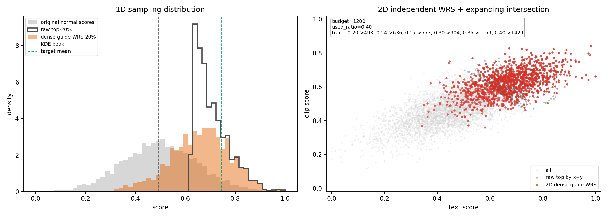

# DOSE: Data Selection for Multi-Modal LLMs via Off-the-Shelf Models

Code release for **DOSE** ([arXiv:2604.16979](https://arxiv.org/abs/2604.16979)).
DOSE builds a compact, high-quality subset of visual instruction tuning data
using only off-the-shelf pretrained models: an instruction-tuned LLM scores
text quality, CLIP scores image-text alignment, and the two scores form a
joint quality-alignment distribution that is sampled with dense-guide weighted
random sampling (WRS). No selection model is trained on the target data, and
no gradient or training signal is required.

## Files

- `text_quality_score.py`: ASK-LLM style text-quality scoring with an
  off-the-shelf LLM; appends `text_quality_score`.
- `clip_score.py`: CLIP image-text relevance scoring; appends `clip_score`.
- `dense_guide_sampling.py`: one-dimensional dense-guide WRS and two-dimensional
  dense-guide WRS with expanding intersection.
- `dense_guide_sampling_visualization.png`: toy visualization of the sampling
  behavior.
- `dense_guide_sampling_visualization.summary.json`: numeric summary for the
  visualization.

## Requirements

```bash
pip install torch transformers open_clip_torch pillow numpy tqdm
```

## Pipeline

1. `text_quality_score.py` appends `text_quality_score` (text quality).
2. `clip_score.py` appends `clip_score` (image-text alignment).
3. `dense_guide_sampling.py` selects the final subset (`dense1d` or `wrs2d`).

## Training Data and Evaluation

We follow [MoE-LLaVA](https://github.com/PKU-YuanGroup/MoE-LLaVA) for the
training data and the evaluation setup:

- **Training data**: preparation, downloads, and directory layout are described
  in [docs/TRAIN.md](https://github.com/PKU-YuanGroup/MoE-LLaVA/blob/main/docs/TRAIN.md).
  DOSE scores this visual instruction tuning data and selects the training
  subset from it.
- **Evaluation**: evaluation data and scripts are described in
  [docs/EVAL.md](https://github.com/PKU-YuanGroup/MoE-LLaVA/blob/main/docs/EVAL.md).

## Text Quality Score

`text_quality_score.py` scores the text of every sample with the ASK-LLM style
template used in DOSE (Table 1). The sample text is rendered into

```text
###
{text}
###

Does the previous paragraph demarcated within ### and ### contain informative
signal for visual instruction tuning a vision-language model? An informative
data point should be well-formatted, contain usable knowledge of the world,
and strictly NOT have any harmful, racist, sexist, etc. content.
OPTIONS:
- yes
- no
Response:
```

and the probability of the "yes" option is appended as `text_quality_score`.
Only the text is scored: `<image>` tokens are stripped from the prompt, as in
the paper's scoring template. No model is fine-tuned; only forward passes are
used. The default scorer is Vicuna-7B (`lmsys/vicuna-7b-v1.5`), the scorer
used in the paper.

Scoring variants (all can be written in the same pass with `--all-variants`):

| Setting | Output field | Definition |
| --- | --- | --- |
| `--answer-mode next --prob-mode pair` (default) | `text_quality_score` | P("yes") with the softmax normalized over the yes/no tokens |
| `--answer-mode next --prob-mode vocab` | `text_quality_score` | raw P("yes") over the full vocabulary |
| `--answer-mode next` | `text_quality_score_margin` | `logit("yes") - logit("no")`, equal to the difference of the two log-probabilities |
| `--answer-mode target` | `text_quality_score_logprob` | teacher-forced log-probability of `--target-answer` (sum over tokens; mean with `--length-normalize`) |

`text_quality_score_logprob` always stores the log-probability of the same
event as `text_quality_score`. The `target` mode is useful for reproducing
older "yes target log-probability" style scores.

Example:

```bash
python text_quality_score.py \
  --input input.json \
  --output output_with_text_quality.json \
  --model lmsys/vicuna-7b-v1.5 \
  --text-source ori_conversations \
  --text-mode all_values \
  --meta-output output_with_text_quality.meta.json
```

Like `clip_score.py`, the input can be split into shards with `--start/--end`
and scored independently; sharding is only for speed. `--dry-run` renders the
prompts without loading any model, which is useful before large runs.

## CLIP Score

This script computes the same CLIP relevance score for every sample. If the
dataset is large, the input can be split into shards and scored independently;
sharding is only for speed and does not change the scoring logic.

By default it concatenates every `value` in `ori_conversations` and scores the
text against the sample image with OpenCLIP `ViT-B-32`, pretrained on
`laion2b_s34b_b79k`.

Example:

```bash
python clip_score.py \
  --input input.json \
  --output output_with_clip.json \
  --image-root /path/to/images \
  --text-source ori_conversations \
  --text-mode all_values \
  --model ViT-B-32 \
  --pretrained laion2b_s34b_b79k
```

## Sampling

Single-dimension dense-guide WRS:

```bash
python dense_guide_sampling.py \
  --input scored.json \
  --output selected_text_20p.json \
  --method dense1d \
  --score-key text_quality_score \
  --ratio 0.2 \
  --seed 42 \
  --meta-output selected_text_20p.meta.json
```

Two-dimension dense-guide WRS with expanding intersection:

```bash
python dense_guide_sampling.py \
  --input scored_with_clip.json \
  --output selected_20p_wrs2d.json \
  --method wrs2d \
  --score-key text_quality_score \
  --clip-key clip_score \
  --ratio 0.2 \
  --expand-ratios 0.20,0.24,0.27,0.30,0.35,0.40,0.50,0.60,0.80,1.00 \
  --seed 42 \
  --meta-output selected_20p_wrs2d.meta.json
```

This does not use raw top scores for a single dimension. It first computes a
dense-guide weight for each dimension independently, then performs weighted
random sampling without replacement. For two dimensions, each dimension gets a
stable weighted random ordering; the merge uses the expanding top-ratio
intersection rule.

The sampling script does not compute LLM logits or CLIP scores. It consumes
existing score fields, for example `text_quality_score` from
`text_quality_score.py` or `clip_score` from `clip_score.py`; an older numeric
column such as `yes_target_logprob_7B_NImg` can also be passed to `--score-key`.

## Visualization Result



It uses 6,000 toy scores sampled from a clipped normal distribution in `[0, 1]`
and selects a 20% budget, i.e. 1,200 samples.

Left panel:

- Gray shows the original normal score distribution.
- Dark outline shows raw top-20% selection, which hard-cuts the right tail and
  produces a narrow high-score-only subset.
- Orange shows dense-guide WRS-20%, which shifts the selected distribution
  toward higher scores while retaining broader coverage than raw top-k.
- Dashed vertical lines show the KDE peak of the original distribution and the
  dense-guide target mean.

Right panel:

- Gray points are all samples in the two-dimensional text-score / CLIP-score
  space.
- Dark points show a simple raw top baseline by `text_score + clip_score`.
- Red points show the final 2D dense-guide WRS samples.
- In this demo, the 20% final budget required expanding the per-dimension
  candidate ratio to 40%:

```text
20% -> 8.2%
24% -> 10.6%
27% -> 12.9%
30% -> 15.1%
35% -> 19.3%
40% -> 23.8%
```

Here, the left side is the candidate ratio used independently in each
dimension, and the right side is the size of their intersection as a percentage
of the full dataset. After the 40% candidate intersection exceeded the 20%
budget, the final subset was truncated to the requested 20%.

## Citation

If you find this work useful, please cite:

```bibtex
@article{wu2026dose,
  title   = {DOSE: Data Selection for Multi-Modal LLMs via Off-the-Shelf Models},
  author  = {Wu, Biao and Zhong, Yiwu and Fang, Meng and Chen, Ling},
  journal = {arXiv preprint arXiv:2604.16979},
  year    = {2026}
}
```

This repository also follows the quality-driven curriculum learning setup
introduced in:

```bibtex
@article{wu2024curriculum,
  title   = {Curriculum Learning with Quality-Driven Data Selection},
  author  = {Wu, Biao and Chen, Ling},
  journal = {arXiv preprint arXiv:2407.00102},
  year    = {2024}
}
```
